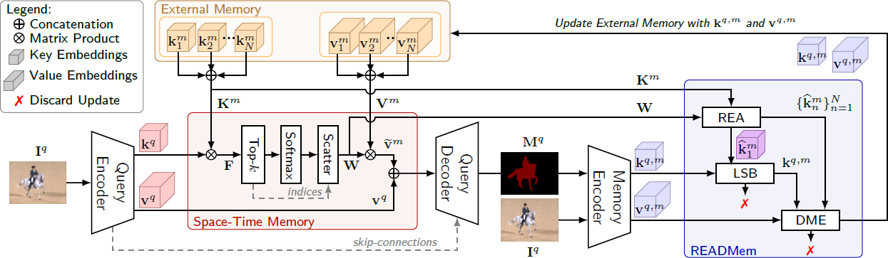

# READMem: Robust Embedding Association for a Diverse Memory in Unconstrained Video Object Segmentation  

*by* **Stéphane Vujasinović**, Sebastian Bullinger, Stefan Becker, Norbert Scherer-Negenborn, Michael Arens and Rainer Stiefelhagen  

- :fire: *Accepted at the* **BMVC 2023**
- 🗒️ [**arXiv**](https://arxiv.org/pdf/2305.12823v2.pdf) - [**BMVC proceeding**](https://github.com/Vujas-Eteph/READMem) - (Videos) - (Poster) - others
- [](https://paperswithcode.com/sota/semi-supervised-video-object-segmentation-on-13?p=readmem-robust-embedding-association-for-a)


**TL;DR**: *We manage the memory of STM like sVOS methods to better deal with long video. To attain long-term performance we estimate the inter-frame diversity of the base memory and integrate the embeddings of an incoming frame into the memory if it enhances the diversity. In return, we are able to limit the number of memory slots and deal with unconstrained video sequences without hindering the performance on short sequences and alleviate the need for a sampling interval.*

---

**📰 News:**
- Yay! Our paper has been accepted at the BMVC 2023 !!
  

---

**🚧 TODO list :**
 - [ ] Method
 - [ ] Results
 - [x] Images
 - [x] BibTeX
 - [ ] Code
 - [ ] Others?
 - [ ] Add Conda environment and required packages

---

## Abstract
> We present READMem (Robust Embedding Association for a Diverse Memory),a modular framework for semi-automatic video object segmentation (sVOS) methods designed to handle unconstrained videos. Contemporary sVOS works typically aggregate video frames in an ever-expanding memory, demanding high hardware resources for long-term applications. To mitigate memory requirements and prevent near object duplicates (caused by information of adjacent frames), previous methods introduce a hyper-parameter that controls the frequency of frames eligible to be stored. This parameter has to be adjusted according to concrete video properties (such as rapidity of appearance changes and video length) and does not generalize well. Instead, we integrate the embedding of a new frame into the memory only if it increases the diversity of the memory content. Furthermore, we propose a robust association of the embeddings stored in the memory with query embeddings during the update process. Our approach avoids the accumulation of redundant data, allowing us in return, to restrict the memory size and prevent extreme memory demands in long videos. We extend popular sVOS baselines with READMem, which previously showed limited performance on long videos. Our approach achieves competitive results on the Long-time Video dataset (LV1) while not hindering performance on short sequences.


## Method / Framework



## Results
The following plot displays the performance variations of baseline sVOS methods with and without our READMem extension on the LV1 dataset when varying the sampling interval.


Checkout our paper and the supplementary material for more qualitative and quantitative results!


## Get Started
(Add Code/Tutorial here)


## Citation
```bibtex
@misc{vujasinović2023readmem,
      title={READMem: Robust Embedding Association for a Diverse Memory in Unconstrained Video Object Segmentation}, 
      author={Stéphane Vujasinović and Sebastian Bullinger and Stefan Becker and Norbert Scherer-Negenborn and Michael Arens and Rainer Stiefelhagen},
      year={2023},
      eprint={2305.12823},
      archivePrefix={arXiv},
      primaryClass={cs.CV}
}
```

## Credits :
- **MiVOS**: [GitHub](https://github.com/hkchengrex/MiVOS) - [Paper](https://arxiv.org/pdf/2103.07941.pdf)  
- **STCN** : [GitHub](https://github.com/hkchengrex/STCN) - [Paper](https://arxiv.org/pdf/2106.05210.pdf)  
- **QDMN** : [GitHub](https://github.com/workforai/QDMN) - [Paper](https://arxiv.org/pdf/2207.07922.pdf)  
- **XMem**: [GitHub](https://github.com/hkchengrex/XMem) - [Paper](https://arxiv.org/pdf/2207.07115.pdf)  
- **DAVIS**: [Webpage](https://davischallenge.org/) for the D17 dataset
- **AFBURR**: [GitHub](https://github.com/xmlyqing00/AFB-URR) - [Paper](https://proceedings.neurips.cc/paper/2020/file/234833147b97bb6aed53a8f4f1c7a7d8-Paper.pdf) for the LV1 dataset  
- **DAVIS Toolkit**: [GitHub](https://github.com/workforai/DAVIS-evaluation) for the evaluation scripts 
