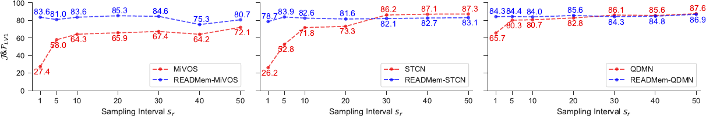

<span style="color:orange;">

## READMem: Robust Embedding Association for a Diverse Memory in Unconstrained Video Object Segmentation  
[](https://paperswithcode.com/sota/semi-supervised-video-object-segmentation-on-13?p=readmem-robust-embedding-association-for-a) 

</span>

*by Stéphane Vujasinović, Sebastian Bullinger, Stefan Becker, Norbert Scherer-Negenborn, Michael Arens and Rainer Stiefelhagen* 

[**[arXiv]**](https://arxiv.org/pdf/2305.12823v2.pdf) - [**[BMVC Proceeding]**](https://github.com/Vujas-Eteph/READMem) - (Videos) - [**[Poster]**](./docs/poster.pdf)

<p align="center">
  
</p>

---

### 📰 News:
- Come chat with me about READMem at poster 113 on Wednesday, October 22, 2023, from 2:00 PM to 4:00 PM.
- Yay! Our paper has been accepted at the **BMVC 2023** !! (See you there 😃)
---

***TL;DR: We manage the memory of STM like sVOS methods to better deal with long video. To attain long-term performance we estimate the inter-frame diversity of the base memory and integrate the embeddings of an incoming frame into the memory if it enhances the diversity. In return, we are able to limit the number of memory slots and deal with unconstrained video sequences without hindering the performance on short sequences and alleviate the need for a sampling interval.***

---

### Some Results

The following plots illustrate performance variations among sVOS baselines with and without our READMem extension on the LV1 dataset. The first plot showcases changes when varying the sampling interval $s_r$​, while the second depicts variations when adjusting the memory size $N$.

<p align="center">
  
</p>

<p align="center">
  
</p>

But check out our paper and supplementary material for more qualitative and quantitative results!

---

### :books: Getting Started
The documentation is split in the following seperate markdown files: 

#### [:blue_book: Installation](./docs/Installation.md)

#### [:closed_book: Inference](./docs/Inference.md)

#### [:green_book: Evaluation](./docs/Evaluation.md)


---

### Citation
```bibtex
@misc{vujasinović2023readmem,
      title={READMem: Robust Embedding Association for a Diverse Memory in Unconstrained Video Object Segmentation}, 
      author={Stéphane Vujasinović and Sebastian Bullinger and Stefan Becker and Norbert Scherer-Negenborn and Michael Arens and Rainer Stiefelhagen},
      year={2023},
      eprint={2305.12823},
      archivePrefix={arXiv},
      primaryClass={cs.CV}
}
```

### Credits :
- **MiVOS**: [GitHub](https://github.com/hkchengrex/MiVOS) - [Paper](https://arxiv.org/pdf/2103.07941.pdf)  
- **STCN** : [GitHub](https://github.com/hkchengrex/STCN) - [Paper](https://arxiv.org/pdf/2106.05210.pdf)  
- **QDMN** : [GitHub](https://github.com/workforai/QDMN) - [Paper](https://arxiv.org/pdf/2207.07922.pdf)  
- **XMem**: [GitHub](https://github.com/hkchengrex/XMem) - [Paper](https://arxiv.org/pdf/2207.07115.pdf)  
- **DAVIS**: [Webpage](https://davischallenge.org/) for the D17 dataset
- **AFBURR**: [GitHub](https://github.com/xmlyqing00/AFB-URR) - [Paper](https://proceedings.neurips.cc/paper/2020/file/234833147b97bb6aed53a8f4f1c7a7d8-Paper.pdf) for the LV1 dataset  
- **DAVIS Toolkit**: [GitHub](https://github.com/workforai/DAVIS-evaluation) for the evaluation scripts 
